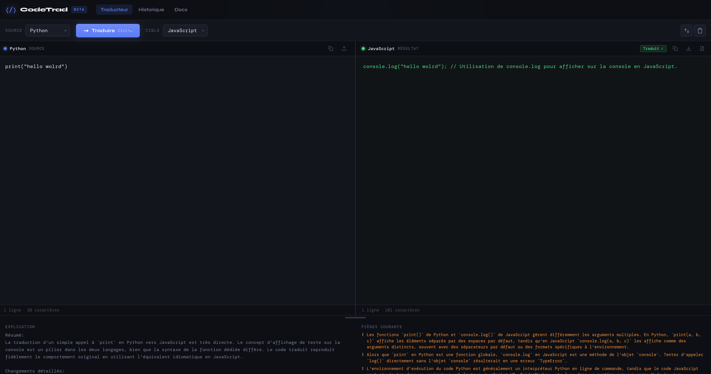
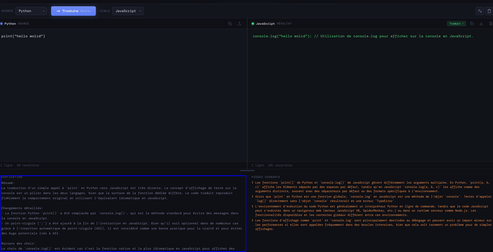
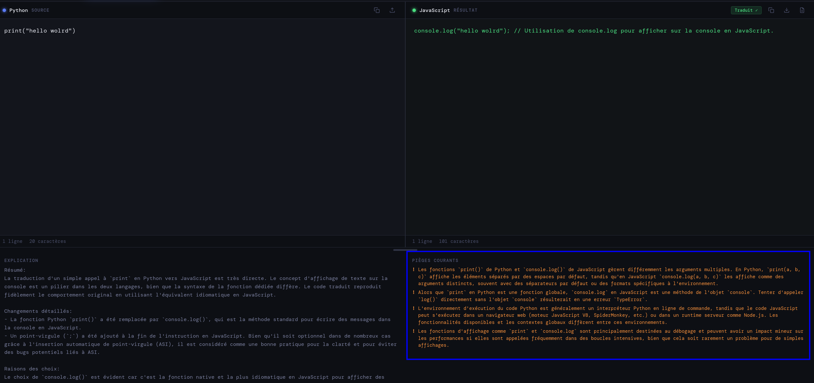

# CodeTranslator — Traducteur de Code entre Langages

Application web qui traduit du code source d'un langage de programmation vers un autre, avec explications pédagogiques des différences et pièges à éviter.

## Aperçu



### Analyse détaillée
| Explications Pédagogiques | Pièges Courants |
| :---: | :---: |
|  |  |

## Architecture

```
Frontend (HTML/CSS/JS + Monaco Editor)
        │
        │  HTTP POST /api/translate
        ▼
Backend (Flask - Python)
        │
        │  Google Gemini API
        ▼
   Modèle LLM (gemini-1.5-flash)
```

## Stack technique

| Couche     | Technologie                          |
|------------|--------------------------------------|
| Frontend   | HTML / CSS / JavaScript, Monaco Editor |
| Backend    | Python 3.12, Flask                   |
| IA         | Google Gemini (gemini-1.5-flash)     |
| Docker     | Docker + docker-compose              |

## Langages supportés

Python, JavaScript, TypeScript, Java, C, C++, C#, Go, Rust, PHP, Ruby, Swift, Kotlin, Scala, R, Bash, SQL

## Installation

### Prérequis

- Python 3.10+
- Une clé API Google Gemini gratuite (https://aistudio.google.com)
- Docker (optionnel)

### Sans Docker

**Backend :**
```bash
cd backend
cp .env.example .env
# Éditez .env et ajoutez votre clé GEMINI_API_KEY
pip install -r requirements.txt
python main.py
```

**Frontend :**  
Ouvrez `frontend/index.html` directement dans votre navigateur, ou servez-le avec un serveur statique :
```bash
cd frontend
python -m http.server 3000
```

### Avec Docker

```bash
cp backend/.env.example backend/.env
# Éditez backend/.env et ajoutez votre clé GEMINI_API_KEY
docker-compose up --build
```

L'application sera disponible sur :
- Frontend : http://localhost:3000
- Backend API : http://localhost:8000

## Utilisation

1. Sélectionnez le langage source et le langage cible
2. Collez ou écrivez votre code dans l'éditeur gauche
3. Cliquez sur **Traduire**
4. Le code traduit apparaît à droite avec une explication des différences et les pièges à éviter

## Structure du projet

```
code_trad/
├── backend/
│   ├── main.py              # Point d'entrée Flask
│   ├── requirements.txt
│   ├── .env.example
│   └── routers/
│       └── translate.py     # Route POST /api/translate
├── frontend/
│   ├── index.html           # Interface principale
│   ├── style.css            # Styles (thème sombre)
│   └── app.js               # Logique Monaco + appels API
├── img/
│   ├── app_global.png
│   ├── focus_explication.png
│   └── focus_piege_courants.png
├── Dockerfile.backend
├── Dockerfile.frontend
├── docker-compose.yml
└── README.md
```

## API

### POST `/api/translate`

**Body :**
```json
{
  "source_code": "def hello(): print('Hello')",
  "source_language": "Python",
  "target_language": "JavaScript"
}
```

**Réponse :**
```json
{
  "translated_code": "function hello() { console.log('Hello'); }",
  "explanation": "En JavaScript, on utilise function au lieu de def...",
  "pitfalls": ["Attention à l'indentation vs accolades", "..."]
}
```

## Répartition du travail

| Membre | Responsabilité |
|--------|---------------|
| Membre 1 | Backend Flask + intégration Gemini API |
| Membre 2 | Frontend HTML/CSS + Monaco Editor |
| Membre 3 | Feature explication + UX (panel pédagogique) |
| Membre 4 | Docker + README + slides de soutenance |
